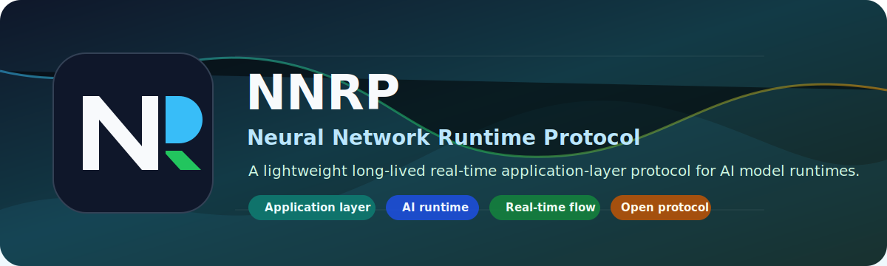

<p align="center">
  
</p>

<p align="center">
  <a href="https://github.com/NagareWorks/nnrp-conformance/actions"></a>
  <a href="https://www.rust-lang.org"></a>
  <a href="https://nagareworks.github.io/nnrp-doc/en/conformance/"></a>
  <a href="https://github.com/NagareWorks/nnrp-conformance/blob/main/LICENSE"></a>
</p>

# nnrp-conformance

Canonical conformance baseline for versioned NNRP protocol lines.

This repository keeps the protocol-facing conformance contract separate from any single SDK repository. The core runner and fixture tooling live in Rust so the baseline can stay strict at the byte and state-machine level, while the public artifacts remain language-neutral JSON.

## Scope

This repository owns:

1. Versioned protocol baselines such as `protocol/nnrp-1-preview2` and `protocol/nnrp-1-preview3`.
2. Public machine-readable manifests for cases, capabilities, and reports.
3. A Rust reference runner that loads a selected baseline, summarizes capability coverage, generates canonical vector manifests, verifies recipe determinism, and compares SDK-exported manifests against canonical output.
4. A suite-owned GitHub composite action that executes the canonical conformance flow for SDK repositories.
5. CI checks that keep the repository itself buildable and the published baselines internally consistent.

This repository does not own host-language API ergonomics, runtime-private test harnesses, or repository-local regressions for one SDK.

## Layout

1. `crates/nnrp-conformance-fixtures`: shared JSON-backed manifest/report types.
2. `crates/nnrp-conformance-runner`: Rust runner and CLI entrypoint.
3. `protocol/`: versioned protocol baselines and canonical manifests.
4. `schemas/`: JSON schema files for public manifests and reports.
5. `docs/todo/`: repository-local execution backlog, split by protocol line and workstream.

## Current Suite Boundary

The current repository state establishes the shared conformance entrypoint described by the protocol design docs:

1. Multiple versioned protocol baselines can coexist under `protocol/`.
2. Capability manifests decide which `mandatory` and `optional` cases are actually selected for a given implementation.
3. Recipe-backed canonical vector manifests can be generated and deterministically verified inside the suite.
4. SDK repositories integrate through the suite-owned `run-conformance` action plus an SDK exporter command, not by embedding suite conformance into local pytest/xUnit coverage jobs.

The protocol-side design now freezes three different integration surfaces:

1. The static exporter contract is the formal integration path that exists today: capability manifest, exporter command, and canonical vector comparison.
2. The adapter execution contract is a separate future-facing surface for dynamic behavior execution. It is reserved at the protocol-design layer, but it is not yet the required CI path in this repository.
3. The benchmark contract is an informational performance surface. It standardizes scenario selection and result shape without requiring SDK APIs to look identical.

Those surfaces must remain separate. Static vector comparison proves byte-shape alignment against the canonical baseline, adapter execution will eventually prove selected state-machine behavior, and benchmark execution tracks performance deltas without becoming a protocol pass/fail gate.

The suite-owned public JSON files for that future adapter surface now live at:

1. `schemas/adapter-execution-plan.schema.json`
2. `schemas/adapter-case-results.schema.json`
3. `docs/examples/adapter-execution-plan.sample.json`
4. `docs/examples/adapter-case-results.sample.json`

The suite-owned public JSON files for informational benchmark execution live at:

1. `schemas/benchmark-execution-plan.schema.json`
2. `schemas/benchmark-results.schema.json`
3. `docs/examples/benchmark-execution-plan.sample.json`
4. `docs/examples/benchmark-results.sample.json`

## Third-Party Implementation Integration

Third-party implementations should consume this baseline through published JSON artifacts and the suite-owned action, not through Rust crate internals.

The repository-supported integration flow is:

1. Pick an explicit baseline under `protocol/<version>/manifest.json`.
2. Provide a capability manifest that declares the same protocol version and only the capability tokens the implementation actually supports.
3. Implement an exporter command that emits a vector manifest using the implementation's real encoder path.
4. Run the suite-owned `run-conformance` action so the suite computes the selected cases, builds the canonical artifacts, and compares the exported manifest.

Third-party implementations must not depend on:

1. Rust-only crate types or helper functions from `nnrp-conformance-runner`.
2. Private repository layout assumptions beyond the published `protocol/`, `schemas/`, and action inputs.
3. SDK-local test framework filters such as `pytest`, `xUnit`, or `cargo test` as though they were the public conformance API.

If an implementation wants deeper behavior validation before the adapter execution contract lands here, that validation remains repository-local. The shared contract in this repository is still the language-neutral manifest, vector, report, and action surface.

When adapter execution is enabled in a later phase, implementations should expect the suite to hand them an execution-plan JSON that already contains the selected public cases, and they should return a case-result report JSON that follows the published schemas above.

When benchmark execution is enabled, implementations should expect the suite to hand them a benchmark execution-plan JSON. SDK repositories own their local benchmark runner commands, API calls, and harness internals; this repository owns only the language-neutral scenario and result JSON shapes.

## Local Commands

Run the full local verification set:

```bash
cargo fmt --all --check
cargo clippy --workspace --all-targets -- -D warnings
cargo test --workspace
```

Print an execution-plan summary against a versioned sample capability manifest:

```bash
cargo run -p nnrp-conformance-runner -- \
  summary \
  --protocol protocol/nnrp-1-preview2/manifest.json \
  --capabilities protocol/nnrp-1-preview2/example-capabilities.json \
  --output artifacts/preview2-summary.json
```

The `summary` command emits the public conformance report shape defined by `schemas/report.schema.json`, including a feature-level `compatibility_matrix` for dashboards and compatibility tracking. It is not a capability manifest and should never be stored or labeled as one.

Emit the public adapter execution-plan JSON for the currently selected cases:

```bash
cargo run -p nnrp-conformance-runner -- \
  adapter-plan \
  --protocol protocol/nnrp-1-preview3/manifest.json \
  --capabilities protocol/nnrp-1-preview3/example-capabilities.json \
  --output artifacts/preview3-adapter-plan.json
```

The `adapter-plan` command emits the public adapter execution-plan shape defined by `schemas/adapter-execution-plan.schema.json`. Implementations can consume that JSON without linking to Rust crates or reading runner internals.

The suite does not freeze SDK-local adapter wrapper names, project paths, or command-line shapes. Each SDK repository owns its own adapter entrypoint contract and implementation backlog. `nnrp-conformance` only freezes the language-neutral execution-plan and case-result JSON shapes plus the suite-side selection semantics.

Emit the public benchmark execution-plan JSON for a versioned protocol and capability manifest:

```bash
cargo run -p nnrp-conformance-runner -- \
  benchmark-plan \
  --protocol protocol/nnrp-1-preview3/manifest.json \
  --capabilities protocol/nnrp-1-preview3/example-capabilities.json \
  --output artifacts/preview3-benchmark-plan.json
```

Validate an SDK benchmark result report against the suite-owned plan:

```bash
cargo run -p nnrp-conformance-runner -- \
  validate-benchmark-results \
  --plan artifacts/preview3-benchmark-plan.json \
  --results artifacts/benchmark-results.json
```

Benchmark results are informational. They are intended for pre/post migration comparisons and steady-state regression tracking, not for protocol correctness gating.

Validate the published JSON artifacts for an explicit baseline against the suite-owned schemas:

```bash
python scripts/validate_public_json.py \
  --protocol protocol/nnrp-1-preview3/manifest.json
```

The `validate_public_json.py` script is the first-class schema-validation path used by CI. It validates the selected protocol manifest, every referenced case/vector/recipe manifest, the baseline example capability manifest when present, and the suite-owned adapter and benchmark example payloads.

Generate and verify the canonical vector manifest from a recipe-backed baseline:

```bash
cargo run -p nnrp-conformance-runner -- \
  generate-vectors \
  --recipe protocol/nnrp-1-preview2/vectors/semantic-vectors.json \
  --output artifacts/local-preview2-vectors.json

cargo run -p nnrp-conformance-runner -- \
  verify-vectors \
  --recipe protocol/nnrp-1-preview2/vectors/semantic-vectors.json \
  --manifest artifacts/local-preview2-vectors.json
```

Compare an SDK-exported manifest against the canonical manifest:

```bash
cargo run -p nnrp-conformance-runner -- \
  compare-vector-manifests \
  --expected artifacts/local-preview2-vectors.json \
  --actual /path/to/sdk-vector-manifest.json
```

## CI Contract

CI must never infer the target protocol line from branch naming or implementation code shape. It must always select an explicit baseline. In the suite repository, that means dynamically enumerating `protocol/*/manifest.json` and running the same suite-owned action against each baseline. In SDK repositories, that means using the suite-owned `run-conformance` action in a dedicated `conformance` job. The suite then verifies that:

1. The protocol manifest version matches the case manifest version.
2. The implementation capability manifest declares the same protocol version.
3. Only claimed capabilities are promoted into the runnable mandatory/optional set.

That rule is the core mechanism that allows development-time testing to stay aligned with completed capabilities rather than with guessed implementation progress.

## Preview3 Bootstrap Gate

Preview3 now has an explicit bootstrap split between blocking protocol minimums and non-blocking expansion surfaces.

Blocking mandatory core for the first bootstrap is limited to:

1. L0 public-header round-trip and invalid-length rejection.
2. L1 handshake and capability negotiation.
3. L1 session open, open-ack, close, and close-ack state-machine minimums.
4. L1 inline tensor submit plus minimum result delivery interoperability.

Preview3 surfaces that are intentionally optional in the current bootstrap are:

1. L1 session resume.
2. L1 multi-session container behavior.
3. L1 operation lifecycle and cancel-scope extensions.
4. L1 cache lifecycle and schema-registry behavior.
5. L1 typed payload and token-profile richer semantics.
6. L2 binding and driver consistency checks.
7. L3 QUIC and TCP integration smoke.

Preview3 surfaces that remain experimental are currently limited to `flow_update`. They are reported so implementations can compare behavior early, but they are not part of the blocking pass/fail gate.

L4 performance and steady-state regression checks are explicitly outside the protocol pass/fail gate for the first Preview3 bootstrap. If performance coverage is added before Preview3 stabilization, it must remain informational and must not block baseline conformance for protocol-correct implementations.

The repository-wide CI exit policy is therefore:

1. Mandatory failures are blocking.
2. Optional cases are selected and executed when claimed, but Preview3 bootstrap treats their failures as non-blocking compatibility-note material rather than as protocol-gate failures.
3. Experimental and deprecated cases are always informational.
4. Not-claimed cases are never treated as failures.
5. L4 performance coverage is never part of the bootstrap protocol gate.

This policy is intentionally stricter about protocol minimums than about feature breadth. Implementations should be able to commit to the shared mandatory floor first, then widen optional coverage without pretending unfinished surfaces are already mandatory.

## Baseline Evolution

Historical baselines are append-only protocol records. Adding a new preview line must never rewrite an older one.

When a new preview line is introduced:

1. Create a new `protocol/<protocol-version>/` directory instead of mutating an older baseline into the new shape.
2. Add a new top-level `manifest.json` that points only at manifests owned by that new protocol directory.
3. Add the new case manifests, vector manifests or recipes, and example capability manifest under that new directory.
4. Add or update any public schema-backed examples or runner behavior only in ways that remain backward-compatible with already-published baseline directories.
5. Let CI discover the new line by enumerating `protocol/*/manifest.json`; do not replace or rename the historical baseline directories.

This repository does not maintain a separate release-branch or baseline-tag workflow. Historical compatibility is tracked directly in `main` through append-only `protocol/<protocol-version>/` directories, and CI always validates those explicit baselines against the current runner and schemas.

## License

This repository is released under the Apache License 2.0. See `LICENSE` for details.
